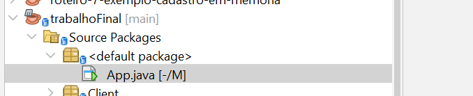

Projeto final da disciplina de programação 1

Integrantes: Rodrigo Munhoz Amaral e Pedro Henrique Knorst

## Rodar o projeto

Primeiro devemos clonar este repositorio:

```
git clone https://github.com/Pedro-HK/trabalho-final-programacao1.git
```

Em seguida abrir a IDE Netbeans e selecionar a opção "Open Project"


Ao selecionar a pasta, seleciona a pasta "trabalhoFinal"


Seleciona a classe App.java



Pressione o botão direito do mouse e clique em "Run file"


## Testar o projeto

### Cliente

No lado do cliente, o usuario pode selecionar entre diversos itens do cardapio, visualizar seus respectivos ingredientes e seu valor


Ao clicar em "Adicionar" o item vai para a lista de itens do pedido
E ao clicar em "Remover Item" o item é removido da lista de itens do pedido
Também é possível visualizar o valor total do pedido


Alem disso, é possivel visualizar o andamento do pedido do cliente. Ao clicar na opção "Ver pedidos"


Onde é possive visualizar todos os pedidos prontos e em andamento


### Restaurante

Na visão do restaurante, é possivel visualizar quais pedidos estão ativos


E ao clicar no pedido, é possivel visualizar as informações do mesmo
Para concluir o pedido, basta clicar em "Concluir pedido"

